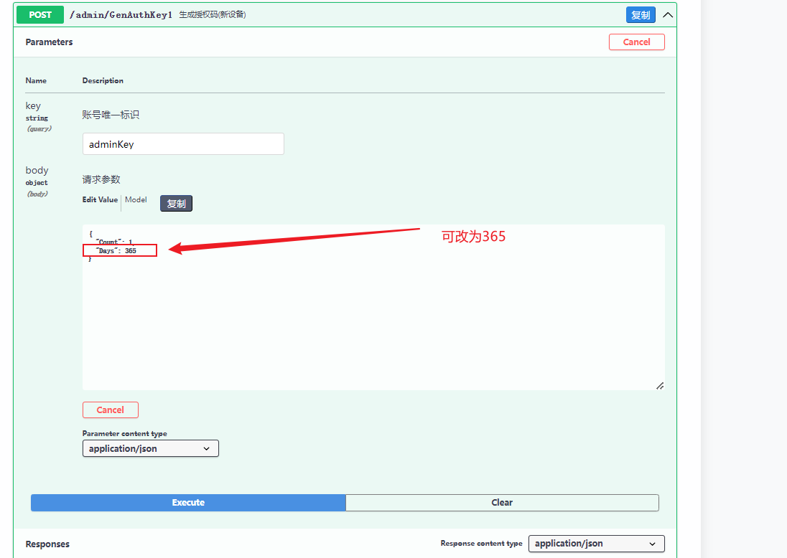
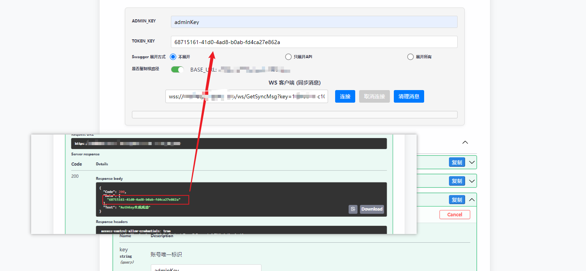
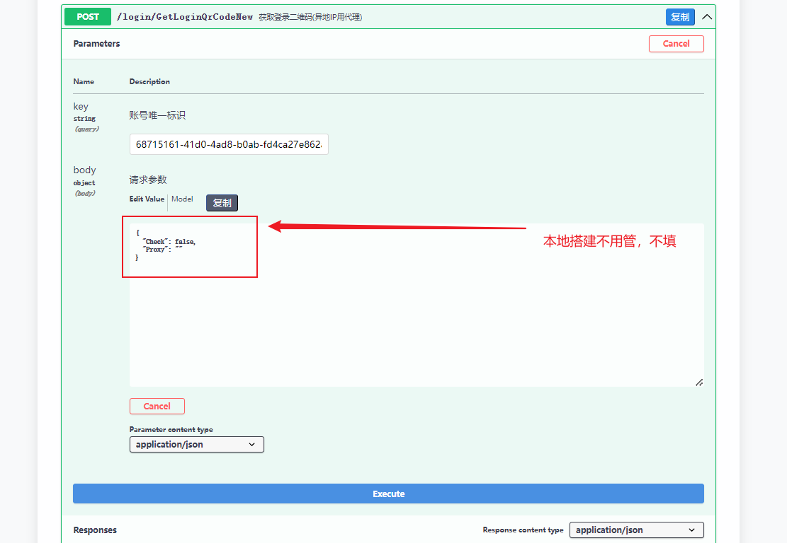
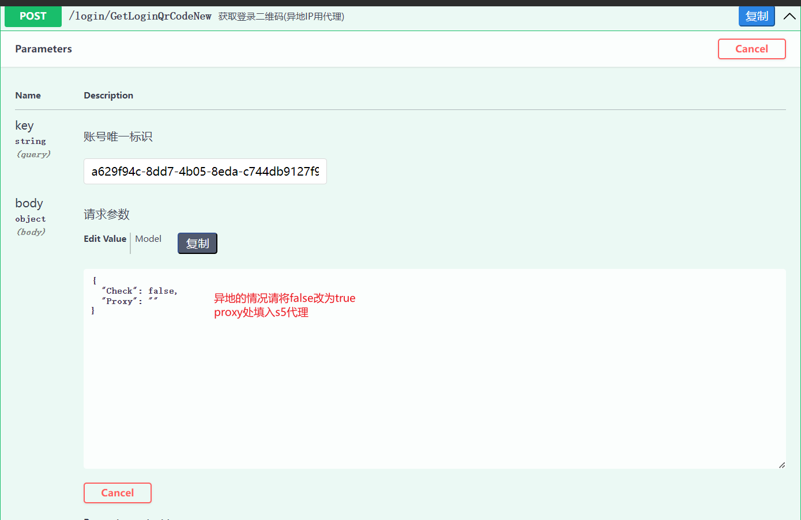
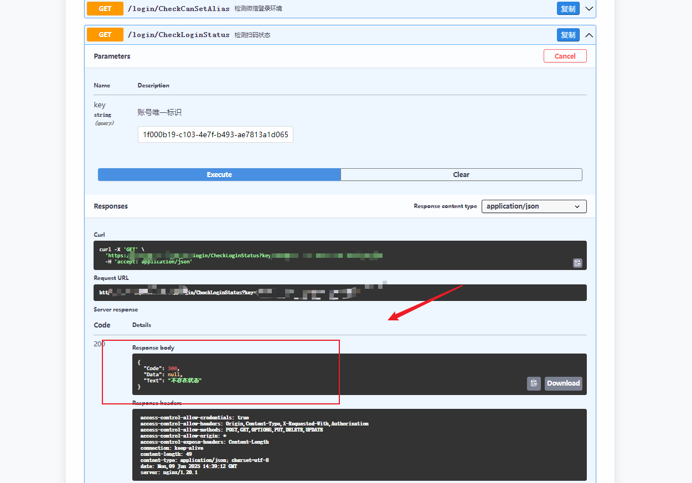

# 通过wechatpadpro 接入个人微信

> 异地警告，没有时s5代理或者本地服务器慎用！！！！！！！

**本教程仅说明docker部署教程，如果可以尽量将wechatpadpro部署到同一网络**


## 拉取wechatpad-docker
1. 原项目
```bash
git clone https://github.com/WeChatPadPro/WeChatPadPro.git
cd WeChatPadPro/deploy
```

2. 简化
```bash
git clone https://github.com/fdc310/WeChatPad-Docker.git
``` 


### 一、如果不更改redis,mysql,adminkey和相关端口及其网络的情况下可以直接运行

```bash
docker compose up -d

```
* 查看日志是否启动成功
```bash
# 简化
docker logs wechatpad
# or 原版
docker logs wechatpadpro
```
启动成功实例如下输出
查看并记录自己的日志生成的Admin_Key,后面登录会用到
```bash
版本号: v20240818.00
======== ADMIN_KEY === adminKey ========
connect MySQL success
auto create MySQL tables success
connect Redis success
GET Connection locfree Failed by ee4c9a06-cf5e-4451-9e81-5290d0217625  abandon the conntection get  !
updateApiVersion success

启动GIN服务成功！ http://0.0.0.0:8849

```

* 然后在本机或者局域网下访问http://serveip:9090进入swagger即可。（这是简化版dockercompose中映射端口号）
* 然后在本机或者局域网下访问http://serveip:1239进入swagger即可。（这是简化版dockercompose中映射端口号）

### 二、如果要更改（简化版）dockercompose网络与langbot在同一个Docker网络中,以及数据库密码和端口更改。

参考修改yaml文件，以下是 WeChatPad 的 yaml 文件，容器连接方式可以参考[文档](/zh/workshop/network-details.html)。
* 如需修改数据库账号密码等，有能力的自行修改，此版本修改需要同时修改项目目录下``app/assets/setting.json`中的用户密码相关


```yaml
version: "3.3"
services:
  mysql_wx:
    # 指定容器的名称
    container_name: mysql_wxpad
    # 指定镜像和版本
    image: mysql:8.0
    ports:
      - "3306:3306"
    restart: always
    # 容器日志大小配置
    logging:
      driver: "json-file"
      options:
        max-size: "5g"
    environment:
      # 配置root密码
      MYSQL_ROOT_PASSWORD: test_mysql
      MYSQL_ROOT_HOST: '%'
      MYSQL_DATABASE: wechatpadpro
    volumes:
      # 挂载数据目录
      - "./mysql/data:/var/lib/mysql"
      # 挂载配置文件目录
      - "./mysql/config:/etc/mysql/conf.d"
    networks:
      - langbot-network
    healthcheck:
      # 可选：健康检查确保MySQL就绪
      test: [ "CMD", "mysqladmin", "ping", "-h", "localhost" ]
      interval: 5s
      timeout: 3s
      retries: 5

  #redis:
  redis_wx:
    # 指定容器的名称
    image: redis:alpine
    container_name: redis_wxpad
    restart: unless-stopped
    command: redis-server --requirepass test_redis
    environment:
      - REDIS_PASSWORD=test_redis
    volumes:
      - ./redis/data:/data
    ports:
      - "6381:6379"
    networks:
      - langbot-network
    healthcheck:
      test: ["CMD", "redis-cli", "-a", "test_redis", "ping"]
      interval: 5s
      timeout: 3s
      retries: 5

  wechatpad:
    # 指定容器的名称
    container_name: wechatpad
    # 指定镜像和版本
    image: alpine:latest
    ports:
      - "9090:8849"
    restart: always
    depends_on:
      mysql_wx:
        condition: service_healthy
      redis_wx:
        condition: service_healthy
    links:
      - mysql_wx
      - redis_wx
    volumes:
      - ./app:/app # 映射数据目录，宿主机:容器
    # 指定工作目录
    working_dir: /app
    # 指定容器启动命令，执行./stay
    command: [ "/bin/sh", "-c", "chmod +x ./stay && ./stay" ]
    # 容器日志大小配置
    logging:
      driver: "json-file"
      options:
        max-size: "5g"
    # 设置时区
    environment:
      - TZ=Asia/Shanghai
      # 设置语言
      - LANG=zh_CN.UTF-8
      # 设置编码
      - LC_ALL=zh_CN.UTF-8
    networks:
      - langbot-network
networks:
  langbot-network:
    external: true

```


### 三、原版dockercompose 需要修改与langbot同一docker网络中，以及数据库用户密码，都那口映射修改可参考以下：
* 如需修改数据库账号密码等，有能力的自行修改，此版本修改需要同时修改项目目录下``deploy/.env`中的用户密码相关

```yaml
version: '3.8'

services:
  wechatpadpro:
    image: registry.cn-hangzhou.aliyuncs.com/wechatpad/wechatpadpro:v0.11
    container_name: wechatpadpro
    restart: always
    ports:
      - "1239:1239"
    volumes:
      - wechatpadpro_data:/app/data
      - wechatpadpro_logs:/app/logs
    environment:
      - TZ=Asia/Shanghai
      - DEBUG=false
      - ADMIN_KEY=12345
      - HOST=0.0.0.0
      - PORT=1239
      - REDIS_HOST=redis
      - REDIS_PORT=6379
      - REDIS_DB=1
      - REDIS_PASS=123456
      - MYSQL_CONNECT_STR=wechatpadpro:123456@tcp(mysql:3306)/wechatpadpro?charset=utf8mb4&parseTime=true&loc=Local
    depends_on:
      mysql:
        condition: service_healthy
      redis:
        condition: service_healthy
    networks:
      - langbot-network

  redis:
    image: registry.cn-hangzhou.aliyuncs.com/wechatpad/wechatpadpro-redis:v0.1
    container_name: wechatpadpro_redis
    restart: always
    command: redis-server --requirepass 123456
    volumes:
      - redis_data:/data
    healthcheck:
      test: ["CMD", "redis-cli", "ping"]
      interval: 5s
      timeout: 3s
      retries: 3
    networks:
      - langbot-network

  mysql:
    image: registry.cn-hangzhou.aliyuncs.com/wechatpad/wechatpadpro-mysql:v0.11
    container_name: wechatpadpro_mysql
    restart: always
    environment:
      - MYSQL_ROOT_PASSWORD=123456
      - MYSQL_DATABASE=wechatpadpro
      - MYSQL_USER=wechatpadpro
      - MYSQL_PASSWORD=123456
      - TZ=Asia/Shanghai
    volumes:
      - mysql_data:/var/lib/mysql
    healthcheck:
      test: ["CMD", "mysqladmin", "ping", "-h", "localhost", "-u", "wechatpadpro", "-p123456"]
      interval: 5s
      timeout: 3s
      retries: 3
    networks:
      - langbot-network

networks:
  langbot-network:
    driver: bridge

volumes:
  wechatpadpro_data:
  wechatpadpro_logs:
  redis_data:
  mysql_data: 
```

#### .env环境变量说明

| 变量名 | 说明 | 默认值 | 是否必填 |
|--------|------|--------|----------|
| DEBUG | 调试模式 | false | 否 |
| ADMIN_KEY | 管理员密钥 | 12345 | 是 |
| PORT | 服务端口 | 1239 | 否 |
| REDIS_PASS | Redis密码 | 123456 | 是 |
| MYSQL_CONNECT_STR | MySQL连接串 | 见配置文件 | 是 |

## 如果要手动部署

* 手动部署或者win上使用docker部署参考以下官方文档

请查看[wechatpadpro文档](https://github.com/luolin-ai/WeChatPadPro)


## 登录微信
1. 成功启动wechatpadpro后根据你的serverip:port访问wechatpadpro的swagger

2. 填入adminKey

3. 获取token
** try it out /admin/GanAuthKey1接口bady中的days改为365即可

等待返回拿到里面的token回填入上面的token

5. 登录微信
** try it out /login/GetLoginQrCodeNew接口即可（和服务器是同市或者同省）

** 如果市云服务器，需要填入Proxy

** 返回的参数中有登录二维码链接，打开扫码登录即可

** 手机登录后看是否有ipad在线，如果不在线就使用,查看扫码状态，

> 没有在线的话是因为什么（这是我已经成功登录，扫码状态过期了）



6. 记录你的adminkey,token,wx地址和访问地址(wxid可以不管)


## 在langbot的创建机器人中填写信息


- wechatpad_key 填写adminKey
- wechatpad_url 填写wechatpadpro的地址
- wechatpad_ws 填写wechatpadpro的ws地址
- wxid 填写该登录账号的的wxid
- wechatpad_token 填写wechatpadpro的token

- 


## 详细的api接口文档

如果有想要为该适配器做贡献，或者制作微信相关插件请查看[wechatpadproAPI文档](https://doc.apipost.net/docs/460ada21e884000?locale=zh-cn  )
里面有相关接口及其参数说明


## 常见问题

### 1. 服务无法启动

检查步骤：
```bash
# 查看服务日志
docker-compose logs

# 查看具体服务日志
docker-compose logs wechatpadpro
docker-compose logs mysql
docker-compose logs redis
```

### 2. 数据持久化

数据默认保存在以下 Docker volumes 中：
- wechatpadpro_data：应用数据
- wechatpadpro_logs：应用日志
- redis_data：Redis数据
- mysql_data：MySQL数据

查看数据卷：
```bash
docker volume ls | grep wechatpadpro
```

### 3. 服务重启

```bash
# 重启所有服务
docker-compose restart

# 重启单个服务
docker-compose restart wechatpadpro
```

## 维护指南

### 日常维护

1. 查看服务状态：
```bash
docker-compose ps
```

2. 查看服务日志：
```bash
docker-compose logs -f --tail=100
```

3. 备份数据：
```bash
# 备份 MySQL 数据
docker exec wechatpadpro_mysql mysqldump -u root -p123456 wechatpadpro > backup.sql
```

### 官方版本升级

1. 拉取最新镜像：
```bash
docker-compose pull
```

2. 重新部署服务：
```bash
docker-compose up -d
```

### 简化版升级
* 需要重新拉取github
```bash
git clone 
cd WeCahtPad_Docker
docker compose down
docker compose up -d
```

## 安全建议

1. 修改默认密码
   - 修改 ADMIN_KEY
   - 修改 MySQL 密码
   - 修改 Redis 密码

2. 限制端口访问
   - 只对必要端口开放外部访问
   - 使用防火墙限制 IP 访问

3. 定期备份
   - 备份 MySQL 数据
   - 备份应用数据

