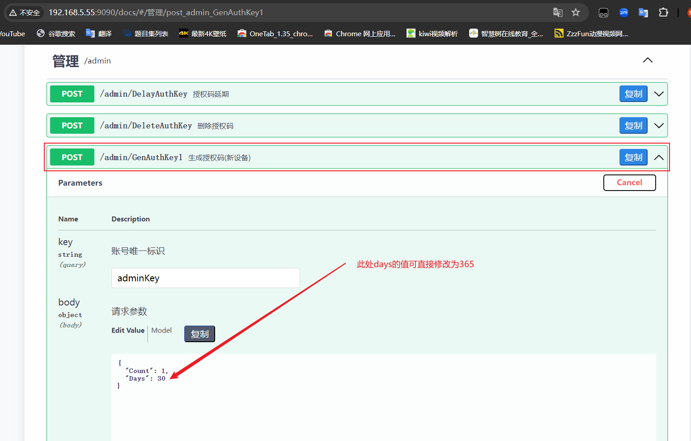
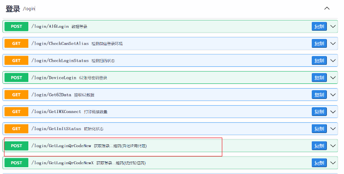
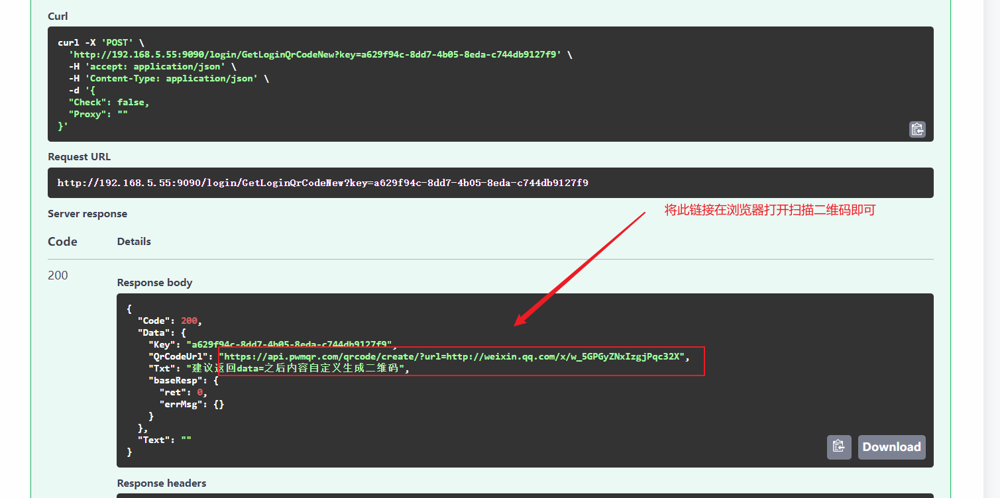
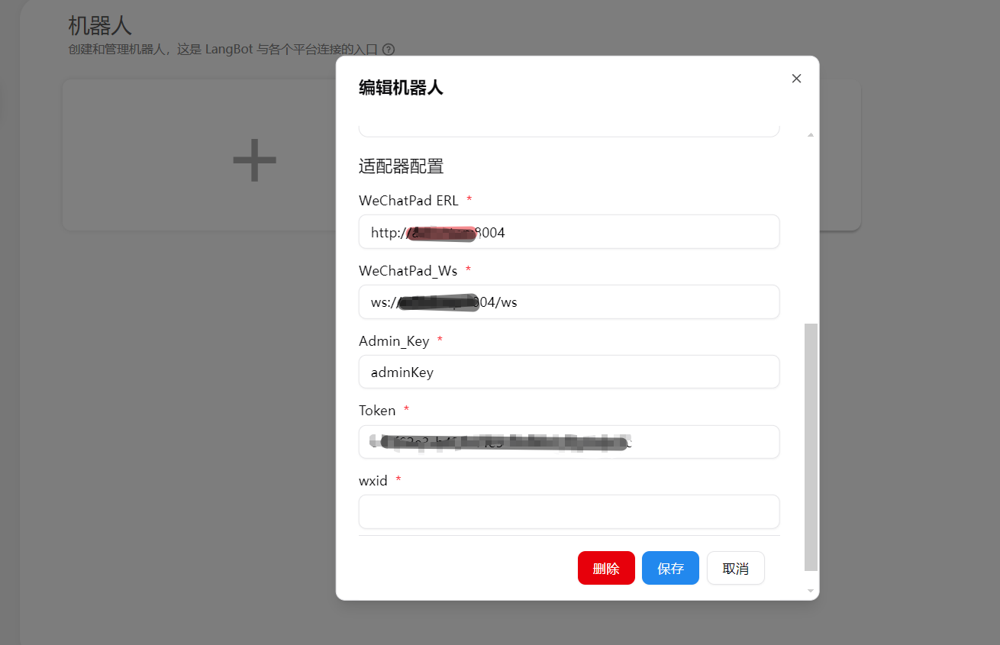

# 通过wechatpadpro 接入个人微信

> 异地警告，没有时s5代理或者本地服务器慎用！！！！！！！

**本教程仅说明docker部署教程，如果可以尽量将wechatpadpro部署到同一网络**


## 拉取wechatpad-docker

```bash
git clone https://github.com/fdc310/WeChatPad-Docker.git
``` 

### 一、如果不更改redis,mysql,adminkey和相关端口及其网络的情况下可以直接运行

```bash
docker compose up -d

```
* 查看日志是否启动成功
```bash
docker logs wechatpad
```
启动成功实例如下输出
```bash
版本号: v20240818.00
======== ADMIN_KEY === adminKey ========
connect MySQL success
auto create MySQL tables success
connect Redis success
GET Connection locfree Failed by ee4c9a06-cf5e-4451-9e81-5290d0217625  abandon the conntection get  !
updateApiVersion success

启动GIN服务成功！ http://0.0.0.0:8849

```

* 然后在本机或者局域网下访问http://serveip:9090进入swagger即可。

### 二、如果要更改网络与langbot在同一个Docker网络中,以及数据库密码和端口更改。

那就修改yaml文件，以下是 WeChatPad 的 yaml 文件，容器连接方式可以参考[文档](/zh/workshop/network-details.html)。


```yaml
version: "3.3"
services:
  mysql_wx:
    # 指定容器的名称
    container_name: mysql_wxpad
    # 指定镜像和版本
    image: mysql:8.0
    ports:
      - "3306:3306"
    restart: always
    # 容器日志大小配置
    logging:
      driver: "json-file"
      options:
        max-size: "5g"
    environment:
      # 配置root密码
      MYSQL_ROOT_PASSWORD: test_mysql
      MYSQL_ROOT_HOST: '%'
      MYSQL_DATABASE: wechatpadpro
    volumes:
      # 挂载数据目录
      - "./mysql/data:/var/lib/mysql"
      # 挂载配置文件目录
      - "./mysql/config:/etc/mysql/conf.d"
    networks:
      - langbot-network
    healthcheck:
      # 可选：健康检查确保MySQL就绪
      test: [ "CMD", "mysqladmin", "ping", "-h", "localhost" ]
      interval: 5s
      timeout: 3s
      retries: 5

  #redis:
  redis_wx:
    # 指定容器的名称
    image: redis:alpine
    container_name: redis_wxpad
    restart: unless-stopped
    command: redis-server --requirepass test_redis
    environment:
      - REDIS_PASSWORD=test_redis
    volumes:
      - ./redis/data:/data
    ports:
      - "6381:6379"
    networks:
      - langbot-network
    healthcheck:
      test: ["CMD", "redis-cli", "-a", "test_redis", "ping"]
      interval: 5s
      timeout: 3s
      retries: 5

  wechatpad:
    # 指定容器的名称
    container_name: wechatpad
    # 指定镜像和版本
    image: alpine:latest
    ports:
      - "9090:8849"
    restart: always
    depends_on:
      mysql_wx:
        condition: service_healthy
      redis_wx:
        condition: service_healthy
    links:
      - mysql_wx
      - redis_wx
    volumes:
      - ./app:/app # 映射数据目录，宿主机:容器
    # 指定工作目录
    working_dir: /app
    # 指定容器启动命令，执行./stay
    command: [ "/bin/sh", "-c", "chmod +x ./stay && ./stay" ]
    # 容器日志大小配置
    logging:
      driver: "json-file"
      options:
        max-size: "5g"
    # 设置时区
    environment:
      - TZ=Asia/Shanghai
      # 设置语言
      - LANG=zh_CN.UTF-8
      # 设置编码
      - LC_ALL=zh_CN.UTF-8
    networks:
      - langbot-network
networks:
  langbot-network:
    external: true

```

## 如果要手动部署

请查看[wechatpadpro文档](https://github.com/luolin-ai/WeChatPadPro)


## 登录微信
1. 成功启动wechatpadpro后根据你的serverip:port访问wechatpadpro的swagger

2. 填入adminKey

3. 获取token
** try it out /admin/GanAuthKey1接口bady中的days改为365即可

等待返回拿到里面的token回填入上面的token

5. 登录微信
** try it out /login/GetLoginQrCodeNew接口即可（和服务器是同市或者同省）

** 如果市云服务器，需要填入Proxy

** 返回的参数中有登录二维码链接，打开扫码登录即可


6. 记录你的adminkey,token,wx地址和访问地址(wxid可以不管)


## 在langbot的创建机器人中填写信息


- wechatpad_key 填写adminKey
- wechatpad_url 填写wechatpadpro的地址
- wechatpad_ws 填写wechatpadpro的ws地址
- wxid 填写该登录账号的的wxid
- wechatpad_token 填写wechatpadpro的token

- 


## 详细的api接口文档

如果有想要为该适配器做贡献，或者制作微信相关插件请查看[wechatpadproAPI文档](https://doc.apipost.net/docs/460ada21e884000?locale=zh-cn  )
里面有相关接口及其参数说明

